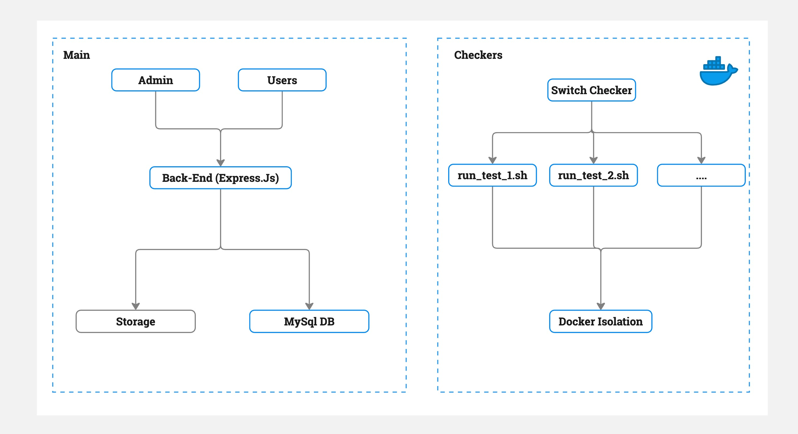

# mycontest.dev[uz]

### Open-Source Contest Platform

MyContest.uz is an open-source platform designed for hosting and managing programming contests. It provides essential tools for running competitions, evaluating solutions, and ranking participants.

### Installation

1. Clone the repository:

   ```sh
   git clone https://github.com/mycontest/mycontest
   cd mycontest
   ```

2. Build the Docker image:

   ```sh
   cd checker/docker && docker build --build-arg SCRIPT_NAME=run_test_1.sh -t run_test_1 .
   ```

3. Install dependencies:

   ```sh
   npm install
   ```

4. Set up environment variables:

   - Copy the `.env.example` file to `.env` and update the environment variables as needed:

     ```sh
     cp .env.example .env
     ```

5. Initialize the MySQL database:

   - Run the database initialization script:

     ```sh
     mysql -u your_user -p your_database < data/db_init.sql
     ```

6. Start the server:

   ```sh
   npm start
   ```

### Required Applications

The platform requires the following dependencies to function properly:

- **Docker** for containerized execution of submissions.
- **Node.js** for the backend server.
- **MySQL** as the database system.
- **Nginx** for handling web traffic.
- **Redis** for caching and session management.

### Additional Setup

- **Architecture Diagram:** The platform architecture is outlined below:

  

- **Nginx Configuration:** The `.nginx` directory in `data/` contains configuration files that can help set up a reverse proxy for deployment.

### Demo

Check out the live demo of mycontest.dev: [Demo Link](https://mycontest.dev)

### Installation Guide (Video)

For a step-by-step installation guide, watch our [YouTube installation video](https://www.youtube.com/watch?v=your_video_id).

### Telegram Channel

Stay updated by joining our [Telegram channel](https://t.me/mensenvau).
